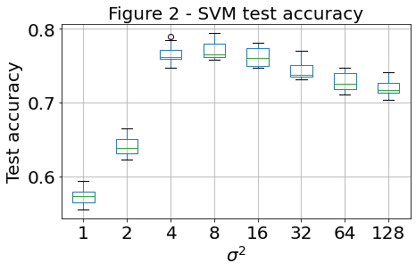
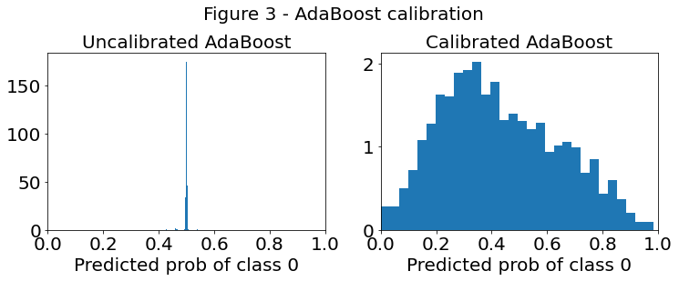

# Predicting Coupon Acceptance Using Machine Learning Algorithms

## Context / ackowledgements

A version of this project was originally completed as part of Professor Cynthia 
Rudin's "Theory and Algorithms for Machine Learning" course at Duke in Fall 2021.
The contents were then written up more formally (and a poster created) as a final
"Portfolio" project for Duke's M.S. in Statistical Science.

This repository is meant to showcase skills in (1) exploratory data analysis,
(2) algorithm selection and fitting, (3) hyperparamter tuning, (4) model 
interpretation, and (5) general critical thinking and problem-solving.

Please see `Report/Portfolio_Report.pdf` or `Poster/Portfolio_Poster.pdf` for
more detail on this project.

## Abstract

In this project, several machine learning algorithms were applied to a binary
classification task to maximize prediction accuracy. The data set was generated 
by a survey on Amazon Mechanical Turk, which offered “Turkers” with high ratings
targeted "20% off" coupons to local businesses. The goal was to predict 
whether a given coupon had been accepted based on information about the user, 
context, and coupon. To this end, the data set was explored and cleaned.
Following feature 
engineering, four machine learning algorithms, Support Vector Machines (SVM), 
Random Forest, AdaBoost, and XGBoost were implemented. For each algorithm, 
hyperparameters were tuned using cross-validation, and model reliance was 
calculated for models with optimal hyperparameters, providing a measure of 
variable importance. Weighted averages of predicted 
probabilities between tuned models were also considered to increase predictive
accuracy. An ensemble formed by a simple average of XGBoost and SVM predictions
achieved the best observed test accuracy of 77.92%.

## Selected images

**Hyperparameter tuning for Support Vector Machine (SVM) model**

**Prediction calbiration for AdaBoost model**

