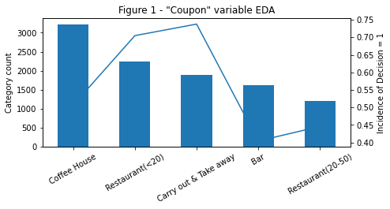
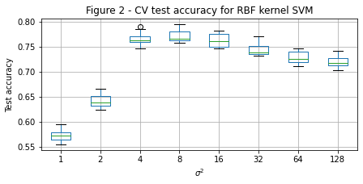
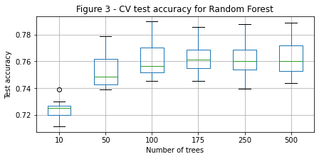
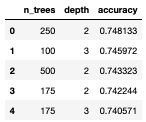
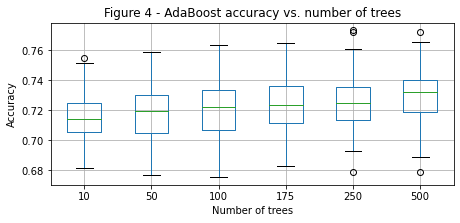
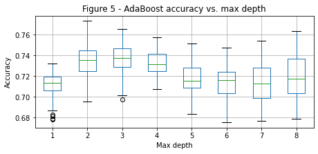
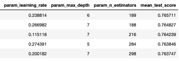
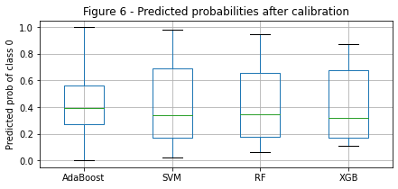
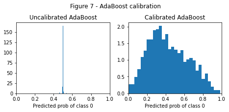
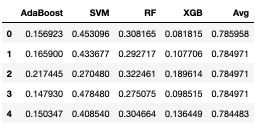

\captionsetup[table]{labelformat=empty}

```{r setup, include=FALSE}
knitr::opts_chunk$set(echo = FALSE, warning = F, message = F)
library(knitr)
library(tidyverse)
library(flextable)
set_flextable_defaults(fonts_ignore = T)
```

# 1 - Introduction

This portfolio project utilized an in-vehicle coupon 
recommendation data set, which was generated via a survey on Amazon 
Mechanical Turk [1]. In this survey, Turkers with high ratings (95% or above)
were offered targeted "20% off" coupons to local businesses. Respondents who 
said they would drive to the coupon location "right away" or "later before the 
coupon expires" were marked as "Decision = 1", while users who answered "no, I 
do not want the coupon" were marked as "Decision = 0." A number of user
attributes (e.g., gender, age), contextual attributes (e.g., driving 
destination, time of day), and coupon attributes (e.g., time to expiry)
were included in the data set, which contained 10,184 training observations
and 2,500 test observations (see Appendix for data dictionary). 
The challenge, then, was to try to predict (i.e., classify) whether a given
coupon had been accepted based on the provided information.

# 2 - Exploratory Analysis

**Variable types:** While the data set contained variables with a mix of
default variable types (i.e., categorical, numeric), it was ultimately decided
that all variables should be categorical. None of the seemingly numeric
features were continuous, nor did gaps between the discrete values of the 
variables have intuitive numerical meaning.

**Missing data:** Though no single variable had more than 182 missing values
in the training data set, 
there were 495 total observations with at least one missing value, which 
constituted almost 5% of the training data set. Rather than remove that much 
data, the 
missing values were simply replaced with the string "NA," which created an 
additional rating category, given the categorical nature of the variables. 

**Feature engineering:** The `id` variable was removed because it was simply 
a unique identifier
for the survey observation. Second, a `Coupon_category_rating`, equal to the
value of `Bar`, `Coffeehouse`, `Carryaway`, `Restaurantlessthan20`, or 
`Restaurant20to50` corresponding to the type of `Coupon`, was created. For 
example, if a `Coupon` was issued for a bar, and the respondent had a value
of 3 for the `Bar` variable, then `Coupon_category_rating` would be set to 3.

**Exploratory data analysis** focused on (1) counts and (2) observed incidence 
of Decision = 1 for 
each category within each variable (see Figure 1 for an example visualization). 
Of particular 
interest, the response variable was fairly balanced with ~57% of respondents
accepting the coupon. All categories within each variable had at least 34
responses with the vast majority having over 100 responses. 

# 3 - Methods

Four different algorithms were considered for this prediction task: Support
Vector Machines (SVM), Random Forest, AdaBoost, and XGBoost. This section
is organized by algorithm and covers both a brief description of the 
algorithm and a description of the training procedure.

### Support Vector Machines (SVM) [2, 3]

In the fully separable case, SVMs aim to create a decision boundary that 
maximizes the distance from the decision boundary to the nearest training
observation. In most real-life applications, however, data are not perfectly 
separable (without tremendous overfitting), and the SVM framework can be 
adapted to include a slack term.
This slack term allows the minimum margin to be less than 1 but adds a penalty
term to the optimization problem in the form of the hinge loss. 

In this project, a Gaussian kernel is used
to fit the data, which constructs decision boundaries by centering
a Gaussian distribution on each data point. This kernel provides a great deal
of flexibility but also risks overfitting training data if not tuned properly.
In particular, the $\sigma^2$ parameter in the kernel defines the shape of
the Gaussian distribution centered on each data point, where a value of 
$\sigma^2$ that is too small will overfit the data, and a value of $\sigma^2$
that is too large will create decision boundaries that do a poor job of 
classifying.

A simple 10-fold cross-validation scheme was used to tune the value of 
$\sigma^2$: The training data was divided equally into 10 segments. Iteratively,
one segment was held out as a test set, and the SVM was trained on the 
remaining 9 segments. The test set accuracy was then averaged across all 10
test segments. This process was repeated (using the same 10 folds) for 8
different values of $\sigma^2$, 
ranging from 1 to 128.

### Random Forest [2, 4]

Random Forests were born out of the idea that averaging the votes of diverse
decision trees leads to strong predictive power. To fit each tree within a 
Random Forest, a bootstrap sample (equivalent in size to the original data set)
is drawn. In creating a tree, only m out of p of the possible predictors 
is considered at each split, and the tree is grown until a minimum number of
observations is present at each leaf. In the package used for this project,
CART trees are used as the base estimator, meaning that Gini index is used
as the splitting criteria. Additionally, m is defined as $\sqrt{p}$, and the 
minimum number of observations in a leaf is 1. 

Predictions are made based on majority vote across all of the trees grown in 
the Random Forest, which reduces the variance / level of overfitting that 
would be achieved from a single, un-pruned tree. The number of trees is the
main hyperparameter that must be tuned, and the same 10-fold cross-validation
strategy described in the SVM section was used to evaluate 6 values, ranging
from 10 to 500. 

### AdaBoost [2, 5]

In general, boosting seeks to address the challenge of turning a "weak learning
algorithm" into a "strong learning algorithm." Freund and Schapire developed 
AdaBoost, which can be described in two different ways.

**Re-weighting data:** At each iteration, the algorithm assigns higher weights
to data points that have been classified incorrectly so that these misclassified
observations will be emphasized during the next iteration. Additionally, the 
contribution of each weak classifier to the final prediction is based on its 
training prediction accuracy.

**Coordinate descent:** At each iteration, the algorithm chooses the direction
(i.e., the weak classifier) that will produce the steepest decrease in the 
exponential loss. Then, the step-size (i.e., contribution to the final model)
is determined based on the training accuracy of the chosen weak classifier.

Typically, decision trees are used as the weak classifiers in AdaBoost, and for
this project, CART decision trees were used. Both the number of trees (like 
Random Forest) and the depth of each tree (unlike Random Forest) are 
hyperparameters that need to be tuned for the AdaBoost algorithm. 
The same 10-fold cross-validation strategy described in the SVM section was 
used to evaluate a grid of 6 different values for number of trees 
(from 10 to 500) and 8
different values for maximum depth (1-8). 

### XGBoost [2, 6]

XGBoost is another boosting algorithm that aims to turn a weak learning 
algorithm into a strong learning algorithm. As with AdaBoost, 
predictions are based on a weighted sum of opinions from all of the weak
classifiers. To highlight a few of the main differences between XGBoost 
and AdaBoost:

- The weak classifier in iteration t of XGBoost is built off of the 
residuals of the weak classifier in iteration t - 1
- XGBoost seeks to minimize the logistic loss, while AdaBoost seeks to 
minimize the exponential loss
- In XGBoost, the learning rate determines how much each new weak classifier
contributes to the final model and is typically the same for all weak 
classifiers

As with AdaBoost, decision trees are typically used as base estimators for 
XGBoost, and for this project, CART decision trees were used. Accordingly,
number of trees and maximum depth of each tree were hyperparameters that needed
to be tuned. Additionally, the learning rate can be highly influential in
model performance and needed to be tuned.

The need to tune three different hyperparameters, each with a wide range
of plausible values, motivated the use of a different type of
cross-validation, randomized search CV. In this method, a distribution of
values is provided for each hyperparameter of interest. At each iteration in
the cross-validation procedure, values are drawn from these hyperparameter
distributions at random, and k-fold cross-validation is performed (5-fold was 
chosen instead of 10-fold due to computational time). Then, at the end of the 
procedure, the hyperparameters of the best performing model (on average across 
the k folds) are returned.

# 4 - Discussion and Results

Table 1 provides a summary of chosen hyperparameters, training error, and
test error for the four algorithms discussed in the previous section. Of note,
the SVM model achieved the highest training (77.13%) and test (76.68%) accuracy,
followed closely by XGBoost (76.53%, 76.28%). All algorithms produced models 
that generated accuracy values 
within a range of 2.5 percentage points on both training (74.81% - 77.13%) 
and test (74.24% - 76.68%) sets. See Figures 2-5 and Tables 2-3 for more 
detailed results from hyperparameter tuning.

To further improve predictive accuracy, ensembles
of multiple models were considered. The best models
for each algorithm were used to predict probabilities of test observations
belonging to each class (as opposed to simply predicting a 0 or 1 label). It
was observed that nearly all of the predicted probabilities for AdaBoost were
within 0.01 of 0.5 (see Figures 6-7). 
As a result, predicted probabilities for all models were
calibrated using the `CalibratedClassifierCV` function within scikit-learn [2].
While numerous combinations of algorithms were considered (see Table 4), a 
simple average of calibrated predicted probabilities between the SVM and XGBoost
models produced the best observed test accuracy of 77.92%.

In addition to computing model accuracy, it was of interest to determine
which variables were most "important" for the best-performing models from
each algorithm. Given that one-hot encoded data sets were used to train all
of the models, a custom model reliance function was written to group all 
relevant columns together (e.g., the "Bar" feature had become 5 one-hot
encoded variables). These groups of columns were then permuted in the
test set, and test errors were calculated. Out of convenience (i.e., 
readily available scikit-learn functions), hinge loss was used for the SVM
model reliance calculation, while logistic loss was used for all other 
algorithms. The five most important features for each algorithm are shown
in Table 5, and `Coupon_category_rating` 
and `Coupon` appear in the top three for all algorithms.

# 5 - Citations and Acknowledgements

This portfolio project is based on an end-of-semester Kaggle competition
in Professor Cynthia Rudin's STA 671 course (Theory and Algorithms for Machine
Learning, Fall 2021).

1. Wang, Tong, Cynthia Rudin, Finale Doshi-Velez, Yimin Liu, Erica Klampfl, and Perry MacNeille. 'A bayesian framework for learning rule sets for interpretable classification.' The Journal of Machine Learning Research 18, no. 1 (2017): 2357-2393.

2. Pedregosa, F. et al., 2011. Scikit-learn: Machine learning in Python. Journal of machine learning research, 12(Oct), pp.2825–2830.

3. Vapnik, V.N., Chervonenkis, A.Y; "On a class of algorithms of learning pattern recognition." Avtomat. i Telemekh. 25.6 (1964): 937.

4. Ho, T.K. (1995) Random Decision Forest. Proceedings of the 3rd International Conference on Document Analysis and Recognition, Montreal, 14-16 August 1995, 278-282.

5. Freund, Y, Schapire, R. "A Decision-Theoretic Generalization of On-Line Learning and an Application to Boosting." Journal of Computer and System Sciences. 1997. 119-139

6. Chen, T., & Guestrin, C. (2016). XGBoost: A Scalable Tree Boosting System. In Proceedings of the 22nd ACM SIGKDD International Conference on Knowledge Discovery and Data Mining (pp. 785–794). New York, NY, USA: ACM. https://doi.org/10.1145/2939672.2939785

# 6 - Appendix

**Data Dictionary [1]**

The attributes of this data set include: 

1. User attributes

- `Gender`: male, female
- `Age`: below 21, 21 to 25, 26 to 30, etc.
- `Maritalstatus`: single, married partner, unmarried partner, or widowed
- `Children`: 0, 1, or more than 1
- `Education`: high school, bachelors degree, associates degree, or graduate degree
- `Occupation`: architecture & engineering, business & financial, etc.
- `Income`: less than \$12500, \$12500 - \$24999, \$25000 - \$37499, etc.
- `Bar`: Number of times that he/she goes to a bar - 0, less than 1, 1 to 3, 4 to 8 or greater than 8
- `Carryaway`: Number of times that he/she buys takeaway food - 0, less than 1, 1 to 3, 4 to 8 or greater than 8
- `Coffeehouse`: Number of times that he/she goes to a coffee house - 0, less than 1, 1 to 3, 4 to 8 or greater than 8
- `Restaurantlessthan20`: Number of times that he/she eats at a restaurant with average expense less than $20 per person - 0, less than 1, 1 to 3, 4 to 8 or greater than 8
- `Restaurant20to50`: Number of times that he/she eats at a restaurant with average expense $20-50 per person - 0, less than 1, 1 to 3, 4 to 8 or greater than 8 

2. Contextual attributes

- `Driving_to`: home, work, or no urgent destination
- `Direction_same`: we provide a map to show the geographical location of the user, destination, and the venue, and we mark the distance between each two places with time of driving. The user can see whether the venue is in the same direction as the destination.
- `Weather`: sunny, rainy, or snowy
- `Temperature`: 30F, 55F, or 80F
- `Time`: 10AM, 2PM, or 6PM
- `Passenger`: alone, partner, kid(s), or friend(s)

3. Coupon attributes

- `Coupon_validity`: 2 hours or one day
- `Coupon`: Coupon category (e.g., bar, coffeehouse)



**Table 1 - Summary of results**

```{r algorithm-results-table}
# Define columns
algos <- c('SVM', 'XGBoost', 'Random Forest', 'AdaBoost')
hyperparams <- c('Gamma = 1/8', 
                 'Num_trees = 189, max_depth = 6, learning_rate = 0.2388',
                 'Num_trees = 175',
                 'Num_trees = 250, max_depth = 2')
train_error <- c('77.13%', '76.53%', '76.35%', '74.81%')
test_error <- c('76.68%', '76.28%', '75.56%', '74.24%')

# Create data frame
df <- data.frame(Algorithm = algos, Hyperparameters = hyperparams, 
                 Train_error = train_error, Test_error = test_error)

# Display result
df %>% 
  regulartable() %>% 
  autofit() %>% 
  width(j=~Hyperparameters, width = 3)
```





**Table 2 - Top AdaBoost models**







**Table 3 - Top XGBoost models**







**Table 4 - Ensemble model coefficients vs. validation set CV accuracy**



**Table 5 - Top 5 features per model, based on model reliance**

```{r model-reliance-table}
# Define columns
idx <- seq(from = 1, to = 5)
svm <- c('Coupon_category_rating', 'Coupon_validity', 'Coupon', 'Income', 
         'Occupation')
rf <- c('Coupon_category_rating', 'Coupon', 'Coupon_validity', 
        'Occupation', 'Restaurantlessthan20')
ada <- c('Coupon_category_rating', 'Coupon', 'Occupation', 'Income',
         'Driving_to')
xgb <- c('Coupon_category_rating', 'Coupon', 'Coupon_validity', 'Occupation',
         'Maritalstatus')

# Create data frame
df <- data.frame(Rank = idx, SVM = svm, Random_Forest = rf, AdaBoost = ada,
                 XGBoost = xgb)

# Display result
kable(df)
```

